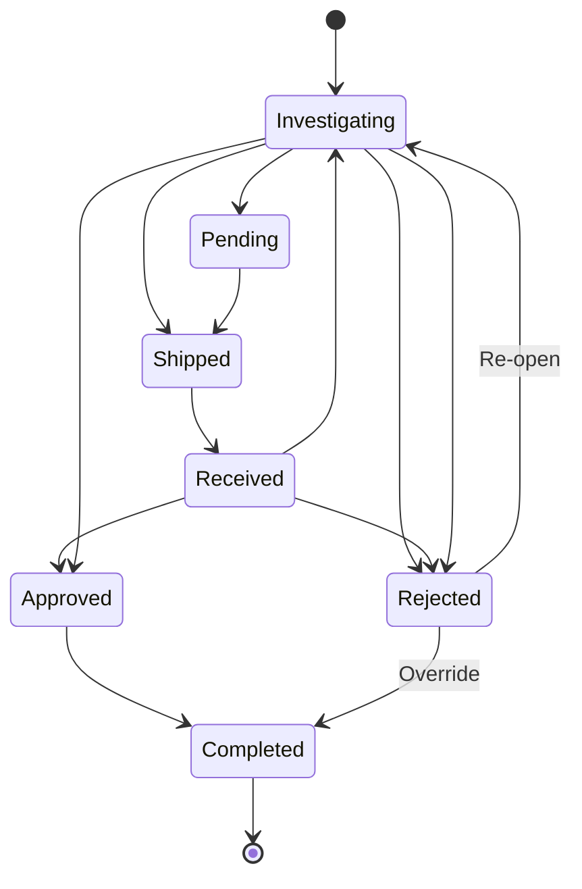

# RMA (Return Merchandise Authorization) Workflow

## Overview

The RMA feature provides automated tracking and serial number management for hardware returns and replacements. When an RMA is marked as completed, the associated asset's serial number is automatically updated to reflect the replacement hardware.

## RMA Lifecycle

### Status Flow



### Available Statuses

| Status | Color | Description |
|--------|-------|-------------|
| **Pending** | Yellow | RMA request created, awaiting shipment |
| **Shipped** | Blue | Hardware shipped to vendor |
| **Received** | Blue | Vendor received the hardware |
| **Investigating** | Blue | Vendor analyzing the issue (default) |
| **Approved** | Green | Vendor approved replacement |
| **Rejected** | Red | Vendor rejected RMA (no replacement) |
| **Completed** | Green | Replacement received and installed |

## Serial Number Management

### Automatic Serial Update

When an RMA status changes to **Completed**, the system automatically:

1. **Checks for replacement serial**: If `replacement_serial` is provided
2. **Updates asset serial**: Changes asset.serial to the new replacement serial
3. **Transaction safety**: Uses database transaction (rollback on error)

### Implementation Logic

```python
# Triggered on save() when status changes to COMPLETED
def update_asset_serial(self):
    if self.status == COMPLETED and self.replacement_serial:
        self.asset.serial = self.replacement_serial
        self.asset.save()
```

**Key Points:**
- ✅ Only updates if `replacement_serial` is provided
- ✅ Only updates when status becomes `COMPLETED`
- ✅ Safe to set status to COMPLETED without replacement_serial (no update occurs)
- ✅ Works even if RMA was previously rejected

## Workflow Examples

### Example 1: Standard RMA Process

1. **Create RMA**
   ```
   Asset: Server-A (serial: "ABC123")
   Status: Investigating
   Original Serial: "ABC123" (auto-populated)
   Replacement Serial: (empty)
   ```

2. **Vendor Approves**
   ```
   Status: Investigating → Approved
   Replacement Serial: (still empty)
   Result: Asset serial unchanged
   ```

3. **Replacement Received**
   ```
   Status: Approved → Completed
   Replacement Serial: "XYZ789" (entered by user)
   Result: Asset serial automatically updated "ABC123" → "XYZ789" ✅
   ```

### Example 2: Rejected Then Approved

1. **Initial Investigation**
   ```
   Asset: Switch-B (serial: "DEF456")
   Status: Investigating
   Original Serial: "DEF456" (auto-populated)
   ```

2. **Initial Rejection**
   ```
   Status: Investigating → Rejected
   Vendor Response: "No defect found, returning original unit"
   Result: Asset serial unchanged
   ```

3. **Re-evaluation**
   ```
   Status: Rejected → Investigating
   Issue Description: (updated with new findings)
   ```

4. **Final Approval**
   ```
   Status: Investigating → Completed
   Replacement Serial: "GHI789"
   Result: Asset serial updated "DEF456" → "GHI789" ✅
   ```

### Example 3: Completed Without Replacement

**Use Case:** Vendor repairs and returns the original unit

1. **Create RMA**
   ```
   Asset: Firewall-C (serial: "JKL012")
   Status: Investigating
   Original Serial: "JKL012"
   ```

2. **Mark as Completed** (repair, not replacement)
   ```
   Status: Investigating → Completed
   Replacement Serial: (leave empty)
   Vendor Response: "Unit repaired and returned"
   Result: Asset serial unchanged (still "JKL012") ✅
   ```

## Field Reference

### Fields

| Field | Type | Required | Auto-populated | Description |
|-------|------|----------|----------------|-------------|
| `rma_number` | CharField | No | No | Vendor's RMA identifier |
| `asset` | ForeignKey | Yes | No | Asset being returned/replaced |
| `original_serial` | CharField | No | **Yes** | Serial before RMA (from asset) |
| `replacement_serial` | CharField | No | No | New serial after replacement |
| `status` | CharField | Yes | Yes (Investigating) | Current RMA status |
| `date_issued` | DateField | No | No | When RMA was created |
| `date_replaced` | DateField | No | No | When replacement was received |
| `issue_description` | TextField | Yes | No | Problem description |
| `vendor_response` | TextField | No | No | Vendor's resolution notes |

### Validation Rules

- ✅ `replacement_serial` can be empty/null
- ✅ `original_serial` is automatically populated from asset on creation
- ✅ Status can transition from any state to any other state
- ✅ Serial update only happens when:
  - Status becomes `COMPLETED` **AND**
  - `replacement_serial` is not empty/null

## Best Practices

### When to Use Each Status

**Pending**: RMA request prepared but not yet shipped
```
- Internal approval obtained
- Preparing shipment documentation
```

**Shipped**: Hardware sent to vendor
```
- Tracking number obtained
- Awaiting vendor receipt confirmation
```

**Received**: Vendor confirmed receipt
```
- Vendor acknowledged receiving hardware
- Awaiting diagnosis
```

**Investigating**: Vendor analyzing issue
```
- Default status for new RMAs
- Diagnosis in progress
```

**Approved**: Vendor approved replacement
```
- Replacement authorized
- Awaiting shipment from vendor
```

**Rejected**: Vendor rejected RMA
```
- No warranty coverage
- No defect found
- Outside of warranty period
```

**Completed**: Replacement installed
```
- New hardware received
- Serial number updated
- RMA closed
```

### Serial Number Management Tips

1. **Always verify replacement serial before completing**
   - Double-check the new serial number
   - Ensure it matches physical hardware
   - Serial update is immediate and automatic

2. **Use Completed status carefully**
   - Once marked completed with a replacement serial, the asset serial changes immediately
   - To revert, you must manually edit the asset serial back

3. **Empty replacement serial is valid**
   - Use when vendor repairs and returns original unit
   - Status can be Completed without triggering serial update

4. **Track original serial**
   - `original_serial` is auto-populated for reference
   - Useful for probe/discovery data correlation

## Integration with Asset Lifecycle

### Probe Data Considerations

When an asset's serial number is updated via RMA:

- **Probe records** are matched by serial number
- **Historical probes** will still reference the old serial
- The asset's `get_related_probes()` method includes RMA serials in its search

### Relationship Diagram

```
Asset (serial: "ABC123")
  ↓
RMA (original_serial: "ABC123", replacement_serial: "XYZ789")
  ↓ (status → COMPLETED)
Asset (serial: "XYZ789") [automatically updated]
  ↓
Probes can find asset via both:
  - Current serial: "XYZ789"
  - RMA original serial: "ABC123"
```

## API Reference

### Create RMA

```bash
POST /api/plugins/inventory-monitor/rmas/
{
  "asset": 123,
  "status": "investigating",
  "issue_description": "Device not powering on",
  "date_issued": "2025-11-06"
}
```

### Update RMA to Completed (with replacement)

```bash
PATCH /api/plugins/inventory-monitor/rmas/456/
{
  "status": "completed",
  "replacement_serial": "NEW-SERIAL-789",
  "date_replaced": "2025-11-10",
  "vendor_response": "Replacement unit shipped"
}
```
**Result**: Asset serial automatically updated to "NEW-SERIAL-789"

### Update RMA to Completed (without replacement)

```bash
PATCH /api/plugins/inventory-monitor/rmas/456/
{
  "status": "completed",
  "date_replaced": "2025-11-10",
  "vendor_response": "Original unit repaired and returned"
}
```
**Result**: Asset serial unchanged

## Troubleshooting

### Serial didn't update when completing RMA

**Possible causes:**
1. `replacement_serial` is empty/null → **Intended behavior** (repair, not replacement)
2. Database transaction failed → Check logs for errors
3. Asset was deleted or modified during save → Check for concurrent modifications

**Solution:**
- Manually set asset serial if needed
- Re-save RMA with proper replacement_serial

### Need to revert serial change

**Scenario:** Accidentally marked as completed with wrong replacement serial

**Solution:**
```bash
# Option 1: Manually edit asset
PATCH /api/plugins/inventory-monitor/assets/123/
{
  "serial": "ORIGINAL-SERIAL"
}

# Option 2: Update RMA original_serial and revert status
PATCH /api/plugins/inventory-monitor/rmas/456/
{
  "status": "investigating"
}
# Then manually fix asset serial
```

### Multiple RMAs for same asset

**Valid scenarios:**
- First RMA rejected, second RMA approved
- Multiple failed replacements
- Separate issues over time

**Behavior:**
- Each completed RMA updates the asset serial sequentially
- Most recent completion wins
- All RMA records remain for audit trail

## Summary

The RMA workflow provides:

✅ **Automated serial tracking** - No manual asset updates needed  
✅ **Flexible status transitions** - Can reject and re-open  
✅ **Safe defaults** - Won't update serial without replacement_serial  
✅ **Audit trail** - All RMA records preserved with original/replacement serials  
✅ **Transaction safety** - Atomic updates prevent partial changes  

**Key Takeaway:** Setting RMA status to `COMPLETED` with a `replacement_serial` automatically updates the asset's serial number. This is immediate and requires no additional action.
